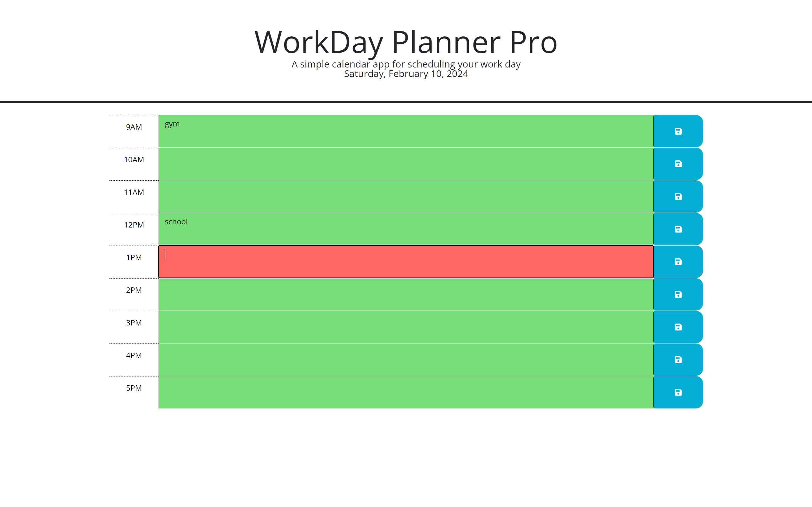

# WorkDay-Planner-Pro

## Description
WorkDay-Planner-Pro is a simple calendar application that allows users to schedule events for each hour of a typical working day (9am to 5pm). It features a clean and intuitive user interface and dynamically updates time blocks to indicate whether they are in the past, present, or future. Users can enter events, save them locally, and persist them even after refreshing the page.

## Preview

## Website
[Visit WorkDay-Planner-Pro](https://dash365.github.io/WorkDay-Planner-Pro/)

## Usage
1. Open the application in your web browser.
2. View the time blocks for the current day, color-coded to indicate past, present, and future hours.
3. Click on a time block to enter an event.
4. Click the save button to store the event locally.
5. Refresh the page, and your saved events will persist.

## Technologies Used
- HTML
- CSS (with Bootstrap)
- JavaScript (with jQuery)
- Day.js

## Contributing
Contributions are welcome! Please fork the repository and submit a pull request with your improvements.

## License
This project is licensed under the [MIT License](LICENSE).
